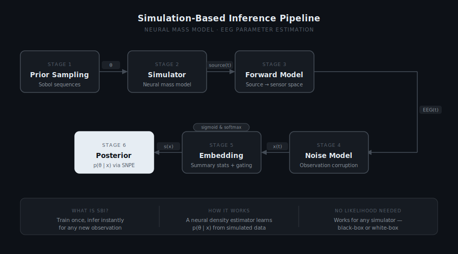

# neural-mass-sbi

A simulation-based inference (SBI) framework for Bayesian parameter estimation of neural mass models from EEG recordings, with the Jansen-Rit model as the reference implementation.

> **Code will be released upon publication.**

---

## Overview

Mechanistic neural mass models offer interpretable, physiologically grounded accounts of EEG dynamics, but fitting them to empirical data is non-trivial: the likelihood is intractable, forward simulations are expensive, and classical optimisation methods scale poorly to multi-parameter spaces. This project addresses all three by framing parameter estimation as amortised Bayesian inference.

Rather than optimising a likelihood for each new observation, a neural density estimator is trained once across the full parameter space using simulated data. At test time, the full posterior distribution over all model parameters is obtained in milliseconds for any new EEG recording — without re-running the simulator.

The pipeline below shows the full data flow, from prior sampling through to posterior estimation. Each stage is modular: the forward model, noise model, and density estimator are independent of the choice of neural mass model, so the framework can be applied to any model that produces a time-series output.

---

## The Jansen-Rit Model

The Jansen-Rit model describes the mean membrane potential dynamics of a cortical column through three interacting neural populations — pyramidal cells, excitatory interneurons, and inhibitory interneurons — each modelled as a second-order linear system driven by a sigmoid nonlinearity. It is one of the canonical generative models for EEG oscillations and provides a well-understood testbed for parameter inference methods.

The model is governed by four parameters:

| Parameter | Symbol | Prior range | Physiological interpretation |
|-----------|--------|-------------|------------------------------|
| Connectivity | C | 135 – 270 | Scales the synaptic coupling strengths between all three populations (C₁ = C, C₂ = 0.8C, C₃ = C₄ = 0.25C) |
| Mean input | μ | 120 – 350 pps | Mean firing rate of afferent input to the pyramidal population |
| Time constant | κ | 0.75 – 1.25 | Multiplicative scale on the excitatory and inhibitory synaptic rate constants |
| Inhibitory gain | g | 0.5 – 2.0 | Scales the inhibitory synaptic amplitude; primary determinant of band power |

All parameters are inferred in log-space. The model is integrated at 1 kHz (Euler method, Δt = 1 ms). The observed signal is the post-synaptic potential difference y₁ − y₂, which corresponds to the EEG-proximal output of the pyramidal population. A 2 s transient is discarded before retaining 3 s of output, which is then downsampled to 250 Hz using a zero-phase anti-aliasing filter.

---

## EEG Forward Model

To move from cortical source activity to scalp EEG, a lead field is computed using MNE-Python's fsaverage template head model. The source is placed at primary visual cortex (MNI coordinates [0, −85, 5] mm) — and the forward solution uses the pre-computed fsaverage three-layer boundary element model (BEM, 5120 triangles per surface) with an ico4 cortical source space and fixed surface-normal dipole orientation. Electrode positions follow the standard 10–20 montage.

Of all electrodes, the one with the highest absolute sensitivity to the source is selected automatically, reducing the multi-channel forward problem to a single scalar projection:

&nbsp;&nbsp;&nbsp;&nbsp;EEG(t) = |L| · source(t)

where |L| is the absolute value of the lead field gain for the selected electrode. The absolute value is used to ensure consistent polarity convention across sources regardless of dipole orientation sign. The forward solution is computed once and cached locally.

---

## Observation Noise

Real EEG recordings contain structured background activity characterised by a 1/f power spectrum. Each simulated EEG epoch is therefore corrupted by pink noise (spectral exponent α = 1) scaled to a randomly drawn signal-to-noise ratio:

&nbsp;&nbsp;&nbsp;&nbsp;x(t) = EEG(t) + ε(t),&nbsp;&nbsp;&nbsp;&nbsp;ε ~ 1/f,&nbsp;&nbsp;&nbsp;&nbsp;SNR ~ Uniform(5, 25) dB

Noise is generated in the frequency domain: white noise is transformed via rfft, shaped by a 1/f amplitude filter, then transformed back via irfft and normalised to unit variance before scaling to the target SNR. Drawing a different SNR per simulation — rather than using a fixed value — trains the posterior to marginalise over noise conditions, producing an estimator that is robust to unknown noise levels at test time.

---

## Summary Statistics

Each 3 s epoch (750 samples at 250 Hz) is compressed into seven interpretable summary statistics before being passed to the density estimator. 

| Feature | Definition |
|---------|-----------|
| Skewness | Third standardised moment: asymmetry of the amplitude distribution |
| Kurtosis | Excess kurtosis (fourth moment − 3): tail heaviness relative to Gaussian |
| Spectral slope | OLS regression slope of log PSD on log frequency, 1–100 Hz |
| Total log power | Log of summed Welch PSD across all frequency bins (DC to Nyquist) |
| Dominant frequency | Frequency of peak Welch PSD in 1–100 Hz band, normalised by Nyquist (125 Hz) |
| Hjorth mobility | √(Var(x′) / Var(x)): proxy for mean signal frequency |
| Hjorth complexity | Mobility(x′) / Mobility(x): proxy for spectral bandwidth |

All features are z-scored using mean and standard deviation computed from the training set before being passed to the density estimator. An optional learned sigmoid gating mechanism can re-weight features during training to quantify which carry the most information about each parameter.

---

## Density Estimator

The posterior p(θ | x) is learned using Sequential Neural Posterior Estimation (SNPE-C), implemented via the [sbi](https://github.com/sbi-dev/sbi) library. The density estimator is a Neural Spline Flow (NSF) conditioned on the summary statistics:

| Component | Setting |
|-----------|---------|
| Architecture | Neural Spline Flow |
| Coupling transforms | 5 |
| Hidden units | 125 |
| Training simulations | 131,072 ($$2^{17}$$)|
| Prior sampling | Sobol quasi-random sequence |
| Optimiser | Adam, lr = 5 × 10⁻⁴ |
| Batch size | 512 |
| Stopping criterion | 15 epochs without validation improvement (max 250) |
| Validation fraction | 15% |

Parameters are drawn from a Sobol quasi-random sequence rather than uniform random sampling, providing more uniform prior coverage for the same number of simulations — particularly important in the corners of the parameter space.

---

## Results

The trained posterior is evaluated on 150 held-out test observations. For each, 1,000 posterior samples are drawn and the posterior mean is taken as the point estimate. Metrics reported are: coefficient of determination (R²), Pearson correlation (r), normalised RMSE (NRMSE, normalised by prior range), and empirical coverage of 50%, 90%, and 95% credible intervals.

| Parameter | R² | Pearson r | NRMSE | Cov50 | Cov90 | Cov95 |
|-----------|------|-----------|-------|-------|-------|-------|
| C — connectivity | 0.793 | 0.891 | 0.127 | 0.51 | 0.93 | 0.96 |
| μ — mean input | 0.744 | 0.868 | 0.150 | 0.47 | 0.91 | 0.96 |
| κ — time constant | 0.711 | 0.844 | 0.158 | 0.48 | 0.85 | 0.91 |
| g — inhibitory gain | 0.925 | 0.962 | 0.081 | 0.55 | 0.91 | 0.94 |
| **Mean** | **0.793** | **0.891** | **0.129** | **0.50** | **0.90** | **0.94** |

The inhibitory gain g is the best-recovered parameter (R² = 0.93), reflecting its strong and distinct influence on oscillation amplitude through the inhibitory synaptic gain. The time constant κ is the most challenging (R² = 0.71), which we attribute to a partial redundancy between κ and μ in shaping the spectral peak frequency — both parameters influence the dominant oscillation frequency through different mechanisms, making their individual contributions difficult to disambiguate. Credible interval coverage is near-nominal across all parameters at the 90% level (0.85–0.93), indicating a well-calibrated posterior.

---

## Acknowledgements

- [MNE-Python](https://mne.tools) — EEG forward modelling and fsaverage template
- [sbi](https://github.com/sbi-dev/sbi) — SNPE implementation
