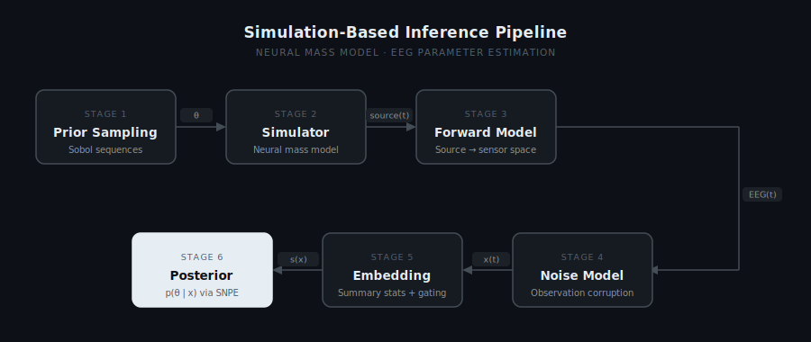

# neural-mass-sbi

> **Code will be released upon publication.**

---

## Key Finding

Feature gating is often treated as a low-cost source of interpretability: a mechanism trained jointly with a predictive model is assumed to reveal, as a byproduct, which inputs the model actually relies on. We test this assumption directly by comparing gate-based feature importance against a gold-standard, retrain-based ablation in a Jansen-Rit simulation-based inference pipeline.

Across ten independent training seeds, the two measures of importance are negatively correlated, despite the gate being trained end-to-end on the same objective the modeler cares about and costing negligible predictive accuracy. The feature ablation identifies as most important is consistently the one both gate variants down-weight most, and the feature ablation identifies as least important is the one both gate variants favor most. Full numbers are reported in [Results : Gating vs. Ablation](#gating-vs-ablation).

---

## Overview

Mechanistic neural mass models offer interpretable, physiologically grounded accounts of EEG dynamics, but fitting them to empirical data is non-trivial: the likelihood is intractable, forward simulations are expensive, and classical optimisation methods scale poorly to multi-parameter spaces. This project addresses all three by framing parameter estimation as amortised Bayesian inference.

Rather than optimising a likelihood for each new observation, a neural density estimator is trained once across the full parameter space using simulated data. At test time, the full posterior distribution over all model parameters is obtained instantaneously for any new EEG recording, without re-running the simulator.

The pipeline below shows the full data flow, from prior sampling through to posterior estimation. Each stage is modular: the forward model, noise model, and density estimator are independent of the choice of neural mass model, so the framework can be applied to any model that produces a time-series output.

---

## Method

### The Jansen-Rit Model

The Jansen-Rit model describes the mean membrane potential dynamics of a cortical column through three interacting neural populations, pyramidal cells, excitatory interneurons, and inhibitory interneurons, each modelled as a second-order linear system driven by a sigmoid nonlinearity. Four parameters are inferred, all in log-space:

| Parameter | Symbol | Prior range | Physiological interpretation |
|-----------|--------|-------------|------------------------------|
| Connectivity | C | 135 – 270 | Synaptic coupling strength between populations |
| Mean input | μ | 120 – 350 pps | Mean firing rate of afferent input to the pyramidal population |
| Time constant | κ | 0.75 – 1.25 | Scale on the excitatory/inhibitory synaptic rate constants |
| Inhibitory gain | g | 0.5 – 2.0 | Scales inhibitory synaptic amplitude; primary determinant of band power |

Excitatory gain is held fixed rather than inferred, since it trades off against inhibitory gain in a near-mirror-image way that would otherwise be hard to identify. Each simulated trial discards an initial transient and is downsampled to 250 Hz before feature extraction.

### EEG Forward Model

Cortical source activity is projected to scalp EEG using a lead field computed from MNE-Python's fsaverage template head model, with the source placed in visual cortex. Rather than collapsing to a single channel, the 5 electrodes with the highest sensitivity to the source are auto-selected, and the signal is projected to each using its **signed** lead-field gain, preserving realistic scalp topography (including sign inversion across electrode pairs).

### Observation Noise

Each simulated epoch is corrupted with pink (1/f) noise at a signal-to-noise ratio drawn independently per trial from Uniform(5, 25) dB. Varying the SNR per trial, rather than fixing it, trains the posterior to marginalise over noise conditions, so the resulting estimator is robust to unknown noise levels at test time.

### Summary Statistics

Each epoch, per electrode, is compressed into seven interpretable summary statistics before reaching the density estimator, then z-scored using training-set statistics:

| Feature | Definition |
|---------|-----------|
| Skewness | Asymmetry of the amplitude distribution |
| Kurtosis | Tail heaviness relative to Gaussian |
| Spectral slope | Slope of log power vs. log frequency, 1–100 Hz |
| Total log power | Log of summed power across all frequency bins |
| Dominant frequency | Frequency of peak power, 1–100 Hz, normalised by Nyquist |
| Hjorth mobility | Proxy for mean signal frequency |
| Hjorth complexity | Proxy for spectral bandwidth |

### Feature Gating

An optional learned gating mechanism can re-weight the 7 features during training, pooled across electrodes so gating operates at the same granularity as the ablation procedure below. Two gate activations are supported:

- **Sigmoid**: each feature's weight is independent; features don't compete.
- **Softmax**: weights are forced to sum to 1 across the 7 features; features compete directly.

To test whether the learned gate is a trustworthy importance signal, this project also implements a gold-standard, **retrain-based ablation**: for each feature, the full pipeline is retrained from scratch with that feature excluded, and the resulting drop in posterior accuracy is measured directly. The two measures of importance are compared using per-seed Spearman rank correlation; see [Results : Gating vs. Ablation](#gating-vs-ablation).

### Density Estimator

The posterior p(θ | x) is learned with Sequential Neural Posterior Estimation (SNPE-C) via the [sbi](https://github.com/sbi-dev/sbi) library, using a Neural Spline Flow (5 transforms, 125 hidden units) trained on 32,768 simulations drawn from a Sobol quasi-random sequence for more uniform prior coverage than independent sampling. 

---

## Results

All metrics below are computed on 250 held-out test observations per training seed, averaged across 10 independently trained seeds.

### Pipeline Validation

Does the underlying SBI pipeline recover parameters accurately and with well-calibrated uncertainty, independent of the gating question?

| Parameter | R² | NRMSE | 90% coverage |
|-----------|------|-------|---------------|
| C (connectivity) | 0.780 | 0.135 | 0.883 |
| μ (mean input) | 0.751 | 0.152 | 0.882 |
| κ (time constant) | 0.720 | 0.157 | 0.826 |
| g (inhibitory gain) | 0.921 | 0.086 | 0.891 |
| **Mean** | **0.793** | **0.132** | **0.871** |

**Cost of gating** — does adding a gate hurt the pipeline's own accuracy?

| Configuration | R² | NRMSE |
|---|---|---|
| No gating (default) | 0.793 (± 0.010) | 0.132 (± 0.003) |
| Sigmoid gating | 0.788 (± 0.019) | 0.134 (± 0.007) |
| Softmax gating | 0.778 (± 0.017) | 0.138 (± 0.006) |

No: the cost is within noise. This matters for the Key Finding, since the gate isn't disagreeing with ablation because it's a poorly-trained or degenerate model.

### Gating vs. Ablation

This is the evidence behind the [Key Finding](#key-finding) above. For each feature: the drop in mean R² when that feature is excluded and the pipeline retrained from scratch (gold-standard ablation), versus the mean weight each gate assigns that feature. Rank 1 = most important by that method.

| Feature | Ablation ΔR² | Rank | Sigmoid weight | Rank | Softmax weight | Rank |
|---|---|---|---|---|---|---|
| Total log-power | 0.209 | **1** | 0.327 | 7 | 0.085 | 6 |
| Skewness | 0.026 | 2 | 0.432 | 5 | 0.112 | 5 |
| Hjorth complexity | 0.025 | 3 | 0.505 | 3 | 0.129 | 3 |
| Kurtosis | 0.022 | 4 | 0.331 | 6 | 0.076 | **7** |
| Hjorth mobility | 0.012 | 5 | 0.617 | **1** | 0.143 | 2 |
| Spectral slope | 0.005 | 6 | 0.457 | 4 | 0.112 | 4 |
| Dominant frequency | −0.008 | **7** | 0.608 | 2 | 0.168 | **1** |

The feature ablation ranks most important (total log-power) gets the lowest or second-lowest gate weight under both activations. The feature ablation ranks least important (dominant frequency) gets the highest or second-highest gate weight under both.

**Rank correlation**, computed per seed and averaged across 10 seeds:

| Comparison | Spearman ρ | p |
|---|---|---|
| Ablation vs. sigmoid gate | −0.546 | 0.0022 |
| Ablation vs. softmax gate | −0.446 | 0.0041 |
| Sigmoid gate vs. softmax gate | 0.829 | 0.0022 |

The two gate variants agree closely with each other; the gate is internally consistent and reproducible across activation functions. It simply tracks something other than what ablation tracks.

---

## Acknowledgements

- [MNE-Python](https://mne.tools): EEG forward modelling and fsaverage template
- [sbi](https://github.com/sbi-dev/sbi): SNPE implementation
